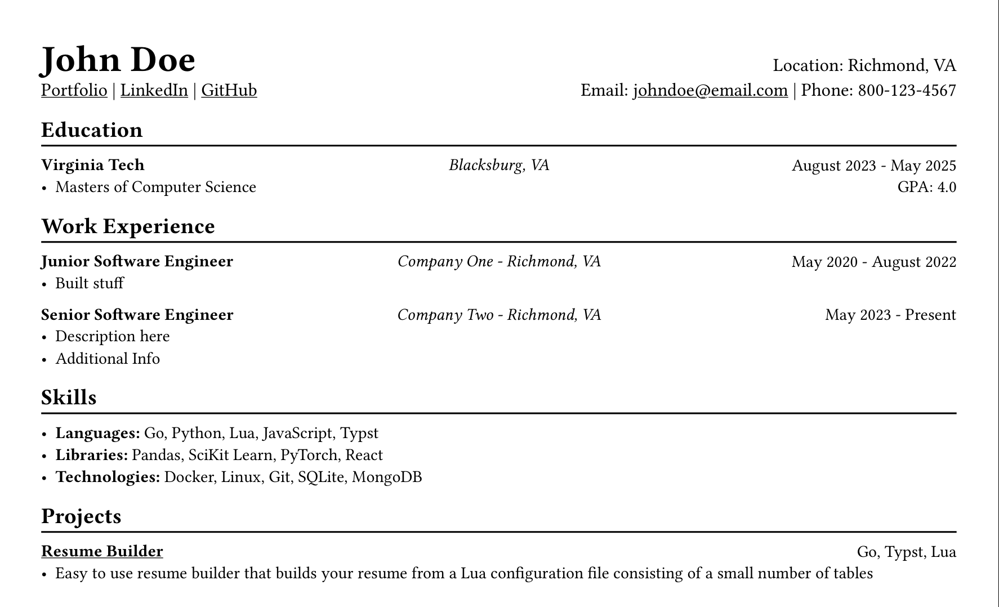

# Rooibos

Rooibos is a programmatic resume builder built using Go and Typst.



## Installation

First, install the necessary [dependencies](#dependencies)

Rooibos can be installed with 'go install':
```sh
go install 'github.com/ptdewey/rooibos'
```

It can also be built from source:
```sh
git clone https://github.com/ptdewey/rooibos.git
cd ./rooibos
go build
```

## Usage

Usage: `rooibos [input-lua-path]`

By default, rooibos will use the lua configuration file found in [examples/contents.lua](./examples/contents.lua).
To use a different file, pass the desired file path as flag argument to the program.

```sh
rooibos -i contents.lua
```

### Configuration

Rooibos is configured through the use of a lua file, an example of which can be found in [examples/contents.lua](./examples/contents.lua).


NOTE: Naming optional tables can cause entries to be out of the specified order

```lua
local resume = {}

-- Personal Info
resume.personal = {
    name = "John Doe",
    phone = "800-123-4567",
    email = "johndoe@email.com",
    location = "Richmond, VA",
    website = "https://example.com",
    github = "https://github.com/johndoe",
    linkedin = "https://linkedin.com/in/johndoe/",
    additional_info = "",
}

-- Education
resume.education = {
    -- Sub-table names are optional for the education table
    masters = {
        institution = "Virginia Tech",
        location = "Blacksburg, VA",
        degree = "Masters of Computer Science",
        dates = "August 2023 - May 2025",
        gpa = "4.0",
    },
}

-- Work Experience
resume.work = {
    -- Sub-table names are optional for the work table
    company2 = {
        job_title = "Senior Software Engineer",
        company = "Company Two",
        dates = "May 2023 - Present",
        location = "Richmond, VA",
        description = {
            "Description here",
            "Additional Info",
        },
    },

    {
        job_title = "Junior Software Engineer",
        company = "Company One",
        dates = "May 2020 - August 2022",
        location = "Richmond, VA",
        description = {
            "Built stuff",
        },
    },
}

-- Projects
resume.projects = {
    -- Sub-table names are optional for the projects table
    {
        name = "Rooibos",
        link = "https://github.com/ptdewey/rooibos",
        tools = { "Go", "Typst", "Lua" },
        description = {
            "Easy to use resume builder that builds your resume from a Lua configuration file consisting of a small number of tables",
        },
    },
}

-- Skills
resume.skills = {
    -- Sub-table names within skills section require names

    -- Programming languages
    languages = {
        "Go",
        "Python",
        "Lua",
        "JavaScript",
        "Typst",
    },

    -- Libraries
    libraries = {
        "Pandas",
        "SciKit Learn",
        "PyTorch",
        "React",
    },

    -- Technologies and Tools
    technologies = {
        "Docker",
        "Linux",
        "Git",
        "SQLite",
        "MongoDB",
    },
}

return resume
```


### Dependencies

Go and Typst are required to use the builder.
No Lua interpreter is required, as one is embedded in the Go program.

| Dependency | Version |
|------------|---------|
| Go         | 1.23.3  |
| Typst      | 0.12.0  |
